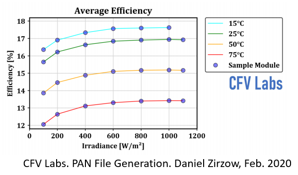
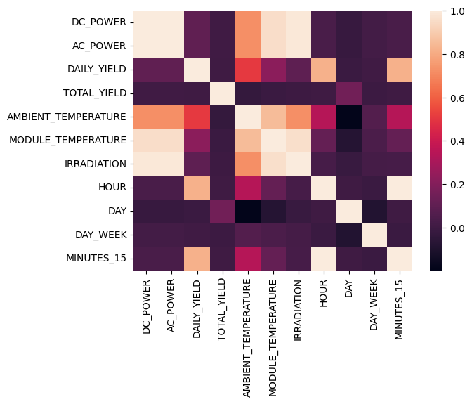
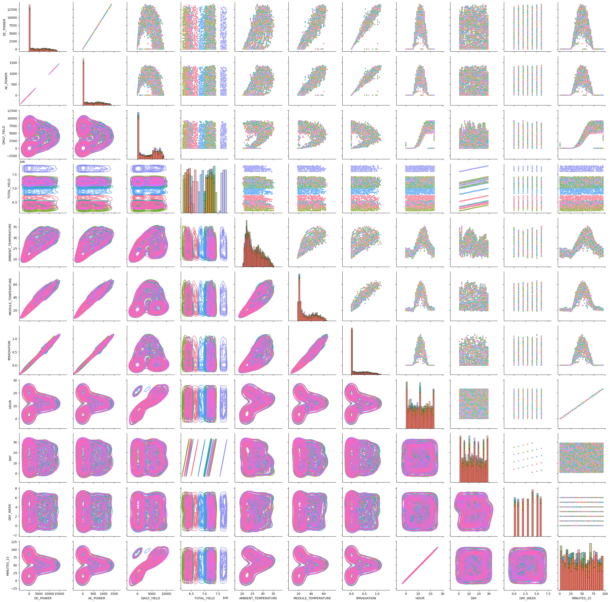
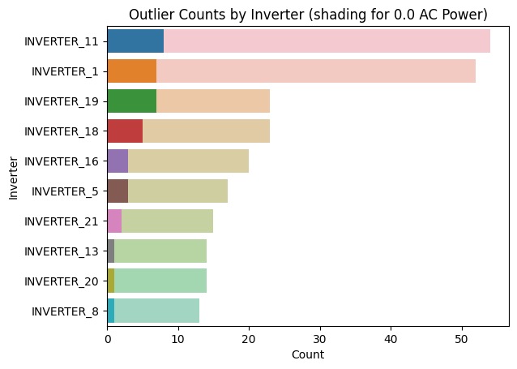
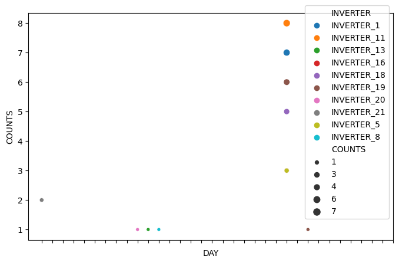
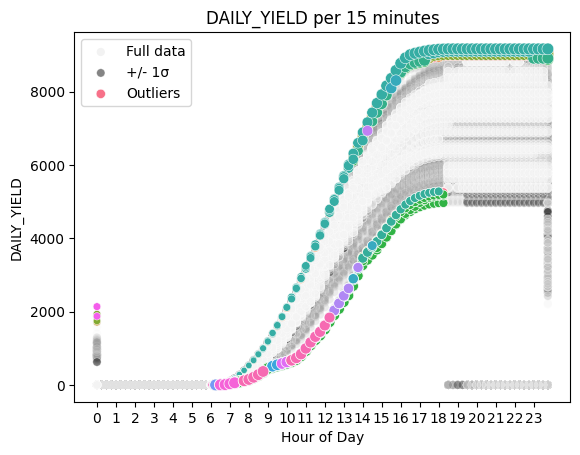

Photovoltaic System Standards 

Many organizations have established standards that address photovoltaic (PV) system component safety, design, installation, and monitoring.

Standards are norms or requirements that establish a basis for the common understanding and judgment of materials, products, and processes. Standards are an invaluable tool in industry and business, because they streamline business practices and provide a level playing field for businesses to develop products and services. They are also critical to ensuring that products and services are safe for consumers and the environment.

There are numerous national and international bodies that set standards for photovoltaics. There are standards for nearly every stage of the PV life cycle, including materials and processes used in the production of PV panels, testing methodologies, performance standards, and design and installation guidelines. The standards shown below are not a complete list but are those most relevant to the procurement and installation of solar PV systems. Each standard has been loosely categorized based on its subject matter.

To start our more in-depth analysis, we'll make some basic datetime features. If we were modeling throughout the year(s), month and year could be interesting to account for seasonal variation and long-term trends, but since our data only covers 34 days, we will omit them. We can use dayofyear to capture any longer trends that might be present

Not surprisingly DC and AC power are highly correlated. This is good! It probably means the inverters in the plant are working correctly to convert the DC to AC. We will ultimately make AC_POWER our target. There is a strong correlation between HOUR and DAILY_YIELD, which makes sense as the daily yield increases throughout the day. For the weather sensor data there is a strong correlation between IRRADIATION and AC_POWER. Also, between MODULE_TEMPERATURE and AC_POWER. Now we will look at a pairplot to see another representation of these relationships and look for any non-linear correlations.

Interestingly, it looks like there are several instances where the power generated during the middle of the day was 0. This could either indicate bad data, malfunctioning inverters, some kind of planned maintenance, cloudy days, sunny days where the plant is overheating/at capacity or any number of other things. Without having a deeper domain knowledge, it is hard to know for sure, but let's see if we can find any pattern to these mid-day outliers.

First, we'll check to see if any inverters in particular are responsible.

There are a greater number of overall outliers on Monday. We might guess that after Sunday maintenance there is a delay getting everything back online that goes into Monday. I think there is enough evidence now to choose to keep these outliers in our data as it might help the model account for some of this. That being said the number is low enough that it likely won't have too much of an impact.

Other Outliers Let's take a quick look at outliers in the other features, before moving to missing data. Since we'll be exploring several different features we can make a function to help streamline the process.

There are some unusual things happening here. Mainly the 0s after 6pm. The straight line down at the end of the day and the other line at the start. These seem like they could be incorrect data, or maybe some kind of correction of previous data. Whatever their exact cause, it is probably best to correct these to make the data less disconnected and ultimately help our model. To fix these we'll make every value during the night equal to the maximum daily yield and set all the daily yields at the beginning of the day to 0.

